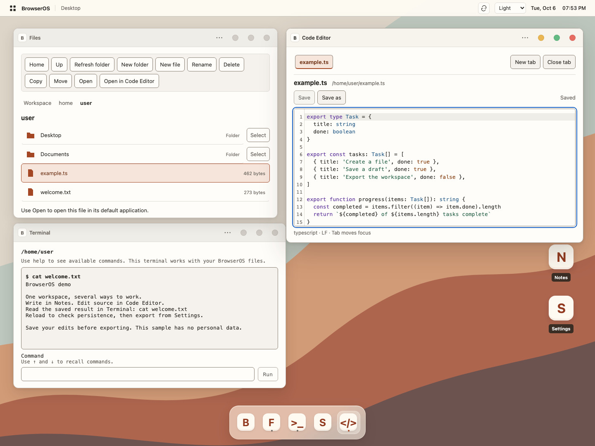
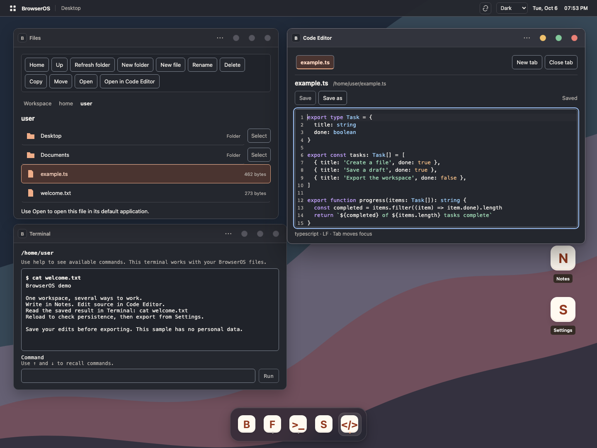

# BrowserOS

A browser-based desktop built with React and TypeScript. Files, Notes, Code Editor
and Terminal share one virtual file system; windows and application lifetimes are
managed by a small frontend runtime. Saved text and appearance settings persist
in IndexedDB, with explicit recovery and temporary-workspace options.

The project focuses on the interactions between subsystems: saving with revision
checks, keeping drafts during conflicts, closing windows safely, disposing lazy
editor resources and reading a consistent snapshot for export.



[Demo walkthrough](DEMO.md) · [Sample files](examples/demo) · [Capture details](assets/screenshots/README.md)

<details>
<summary>Dark theme and more screenshots</summary>



[Light desktop](assets/screenshots/desktop-light.png) ·
[Dark desktop](assets/screenshots/desktop-dark.png) ·
[Getting started](assets/screenshots/about-light.png) ·
[Saved-data export](assets/screenshots/export-dark.png)

</details>

## Try it locally

Node.js **24.18.0** is pinned in `.nvmrc`.

```bash
npm ci
npm run dev
```

Open the localhost URL printed by Vite. With nvm, run `nvm install` and `nvm use`
first. Browser data belongs to the current origin: changing hostname or port gives
another workspace.

## Implemented features

| Area        | Behavior                                                                                                          |
| ----------- | ----------------------------------------------------------------------------------------------------------------- |
| Desktop     | Dock, app shortcuts, light/dark/system appearance, clock and workspace refresh                                    |
| Windows     | Pointer and keyboard move/resize, minimize, maximize/restore, menus and focus return                              |
| Files       | Browse, create, rename, move, copy text files and delete files/folders; open in Notes or Editor                   |
| Notes       | Explicit Save/Save As, dirty-close protection, conflicts and recovery of deleted documents through Save As        |
| Code Editor | Lazy CodeMirror, JS/TS/JSX/TSX highlighting, up to 20 tabs, find/replace, undo/redo and per-tab selection/history |
| Terminal    | `pwd`, `ls`, `cd`, `mkdir`, `touch`, `cat`, `echo`, `clear`, `cp`, `mv`, `rm`, `help`; bounded output and history |
| Settings    | Committed appearance preference, storage-mode information and versioned saved-data JSON export                    |
| Recovery    | Classified storage errors, retry, user-selected temporary mode and isolated application render failures           |

Notes is the default text-file handler. Files also offers **Open in Code Editor**.
The editor preserves LF/CRLF/CR; mixed line endings require explicit conversion
before editing. Terminal handles its own commands and literal text, without shell
operators, expansion or arbitrary code execution.

## A short walkthrough

1. In Files, create `hello.txt`, open it in Notes, enter text and save.
2. In Terminal, run `cat hello.txt` from its initial `/home/user` directory.
3. Open the same file in Code Editor, edit and save; reload and reopen it in Files.
4. In Settings, choose **Prepare export → Download JSON**. The copy contains saved
   text files, folders and the committed theme; unsaved drafts are excluded.

## Architecture

The stack is React, strict TypeScript, Vite, Zustand, IndexedDB and CSS Modules.
Domain rules live in plain TypeScript services. React owns rendering and local
interaction; persistent data goes through repository adapters.

- [Architecture and state ownership](architecture/README.md)
- [Domain services and local React state](architecture/decisions/001-state-ownership.md)
- [Commit semantics and revision conflicts](architecture/decisions/002-persistence.md)
- [Lazy CodeMirror with canonical document sessions](architecture/decisions/003-editor.md)
- [Consistent export and explicit recovery](architecture/decisions/004-export-recovery.md)

## Validation

```bash
npm run check
npx playwright install chromium firefox webkit
npm run test:e2e
npm run test:persistence
npm run test:cross-browser
```

Run these sequentially: preview suites share the build directory and server port.
On Linux, use Playwright's `install --with-deps` to install system libraries too.
See [CONTRIBUTING](CONTRIBUTING.md) for CI, reports and setup details.

The latest local validation contains 550 unit/integration tests, 102 Chromium
scenarios, 180 native IndexedDB checks and 30 Firefox/WebKit smoke scenarios.
GitHub Actions runs quality and browser jobs. The [hosted run on the corrected commit](https://github.com/minemaps251-ship-it/browser-os/actions/runs/37498029505)
passed quality, Chromium, native persistence and Firefox/WebKit smoke. New changes
still need their own hosted run after pushing. Playwright WebKit coverage does not establish full Safari/iOS support.

`npm run test:performance` profiles 1,000 files, ten windows, a roughly 256 KiB
editor document and repeated resource release. It emits timings, browser trace,
GC heap/DOM counts and bundle sizes. This diagnostic workload has no machine-specific
speed thresholds and does not certify the absence of all memory leaks.

## Current limits

- Text-only VFS: 2,000 nodes, 1 MiB per file and 10 MiB total UTF-8 text. Recursive
  folder copy, binary files, trash and import/reset are not implemented.
- JSON export is bounded to 64 MiB and prepared synchronously. Downloaded copies
  remain unchanged until prepared again; there is no restore/import UI.
- Saved data is origin-local. There is no backend synchronization or account system;
  browser eviction/site-data clearing can remove it. Temporary mode is lost on reload.
- Open tabs, undo history and unsaved drafts do not survive reload or tab termination.
  Before-unload protection is best effort.
- Keyboard, focus, reduced motion, selected contrast and forced-color paths have
  automated checks. Manual VoiceOver, actual 200% browser zoom, OS IME and hardware
  touch validation remain open; no WCAG-compliance claim is made.

## Release work remaining

Finish manual accessibility checks, finalize licensing and publish on a stable origin.
A walkthrough and genuine screenshots are available; a recorded demo video is optional
future work. New commits must pass CI. Task Manager, command palette, extra utility
apps and advanced window layouts remain optional.
